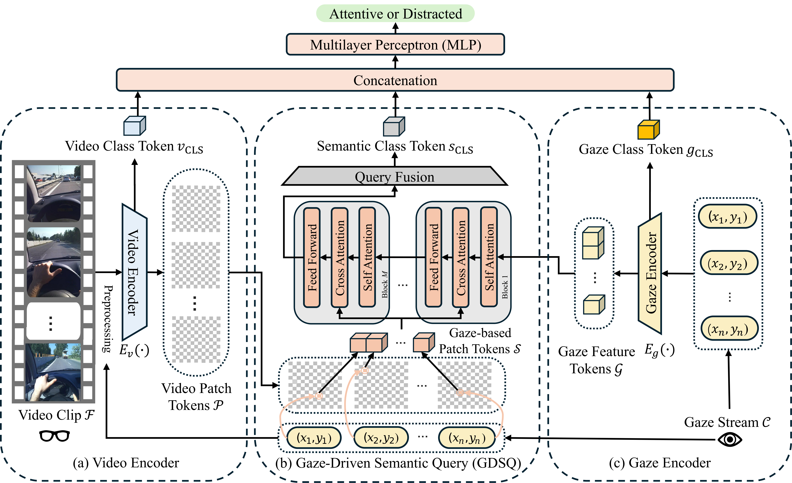

<p align="center">
  <h1 align="center"> <ins>EyeCue</ins><br>Driver Cognitive Distraction Detection via Gaze-Empowered Egocentric Video Understanding</h1>
  <h3 align="center">IJCAI 2026</h3>
  <p align="center">
    <a href="mailto:langzhang@vt.edu">Lang Zhang</a><sup>1</sup>
    ·
    <a href="mailto:jinyiyoon@inha.ac.kr">JinYi Yoon</a><sup>2</sup>
    ·
    <a href="mailto:matthew.corbett@westpoint.edu">Matthew Corbett</a><sup>3</sup>
    ·
    <a href="mailto:asarkar@vtti.vt.edu">Abhijit Sarkar</a><sup>1</sup>
    ·
    <a href="mailto:boji@vt.edu">Bo Ji</a><sup>1</sup>
  </p>
  <p align="center">
    <sup>1</sup>Virginia Tech &nbsp;
    <sup>2</sup>Inha University &nbsp;
    <sup>3</sup>Army Cyber Institute at West Point
  </p>

  <div align="center">

  [](https://arxiv.org/abs/2605.07859)
  [](LICENSE)

  </div>
</p>

Official implementation of the IJCAI 2026 paper:
**"[EyeCue: Driver Cognitive Distraction Detection via Gaze-Empowered Egocentric Video Understanding](https://arxiv.org/abs/2605.07859)"**

<p align="center">
  
  <br>
  <em>EyeCue fuses egocentric video and gaze sequences through cross-attention to detect cognitive distraction in drivers.</em>
</p>

## Overview

**EyeCue** is a multimodal framework for detecting cognitive distraction in drivers using egocentric (first-person) video and synchronized gaze data. Unlike prior work that treats video and gaze independently, EyeCue introduces a **gaze-guided patch selection** mechanism: for each frame, the gaze point is mapped to a specific spatial patch in the video token space, and a cross-attention fusion module allows gaze signals to actively query visual context. This produces a semantically grounded representation that captures *what the driver is looking at*, not just where.

The model is trained end-to-end for binary classification — distinguishing cognitively distracted from attentive driving states.

## Highlights

- **Gaze-guided patch selection** maps per-frame gaze coordinates directly to video patch tokens in the TimeSformer feature space
- **Cross-attention semantic fusion** lets gaze tokens query video tokens, propagating spatial attention across modalities
- **Lightweight gaze encoder** with a learnable CLS token encodes raw (x, y) gaze sequences into rich representations
- **End-to-end training** on paired egocentric video + gaze data, no hand-crafted features required
- **Egocentric perspective** leverages first-person viewpoint for naturalistic distraction assessment

## Installation

**Requirements:**
- Python ≥ 3.9
- CUDA 11.8+ (GPU strongly recommended)
- PyTorch 2.6.0

```bash
git clone https://github.com/langzhang2000/EyeCue.git
cd EyeCue

# Install PyTorch with CUDA 11.8
pip install torch==2.6.0 torchvision==0.21.0 torchaudio==2.6.0 \
    --index-url https://download.pytorch.org/whl/cu118

# Install remaining dependencies
pip install -r requirements.txt
```

The pretrained TimeSformer backbone (`facebook/timesformer-base-finetuned-k600`) will be downloaded automatically from Hugging Face on first run.

## Dataset

EyeCue is trained and evaluated on **CogDrive**, our egocentric driving dataset with synchronized gaze recordings.

**Download:** [CogDrive Dataset (Google Drive)](https://drive.google.com/drive/folders/1m3Xh8aVtOiX9IGyhLH9TlP4nX6gSrWi3?usp=sharing)

The dataset contains three folders:
- `all_gaze_coordinate` — gaze point data for all recordings
- `all_video_heatmap` — videos with gaze heatmap overlay
- `all_video_raw_resize` — resized raw videos

## Getting Started

### Data list format

Training, validation and test splits are plain text files with one clip per
line, three space-separated fields:

```
<video_path> <gaze_path> <label>
```

- `video_path` — an `.mp4` clip
- `gaze_path` — a `.txt` file with `n` rows and 2 columns, the `(x, y)` gaze
  point of each frame (pixel coordinates in a 960×720 frame)
- `label` — `0` (attentive) or `1` (cognitively distracted)

Example:

```
/data/clips/BDDA_2000.mp4 /data/gaze/BDDA_2000.txt 1
```

### Training

```bash
python new_train.py \
    --train_list /path/to/train.txt \
    --val_list   /path/to/val.txt \
    --batch_size 4 \
    --epochs     15 \
    --lr         1e-5 \
    --clip_len   8 \
    --save_dir   checkpoints
```

**Key arguments:**

| Argument | Default | Description |
|---|---|---|
| `--train_list` | required | Path to training list file |
| `--val_list` | required | Path to validation list file |
| `--batch_size` | `4` | Batch size |
| `--epochs` | `15` | Number of training epochs |
| `--lr` | `1e-5` | Learning rate |
| `--clip_len` | `8` | Number of frames sampled per clip |
| `--num_workers` | `1` | DataLoader worker threads |
| `--device` | auto | `cuda` or `cpu` |
| `--save_dir` | `checkpoints` | Directory to save model weights |

Checkpoints are saved as:
- `best_model.pth` — full model at best validation accuracy
- `eye_video_encoder.pth` — video encoder weights only

### Inference

Evaluate a trained checkpoint over a test list:

```bash
python infer.py \
    --test_list  /path/to/test.txt \
    --checkpoint checkpoints/best_model.pth \
    --out_csv    predictions.csv
```

This reports accuracy, precision, recall, F1 and the confusion matrix, and
writes per-sample predictions to `--out_csv` with the columns
`filename, label, pred, prob_distracted`.

| Argument | Default | Description |
|---|---|---|
| `--test_list` | required | Path to test list file |
| `--checkpoint` | `checkpoints/best_model.pth` | Checkpoint written by `new_train.py` |
| `--out_csv` | `predictions.csv` | Where to write per-sample predictions |
| `--batch_size` | `4` | Batch size |
| `--clip_len` | `8` | Number of frames sampled per clip |
| `--num_workers` | `1` | DataLoader worker threads |
| `--seed` | `42` | Random seed |
| `--device` | auto | `cuda` or `cpu` |

> **Note on reproducibility.** `VideoGazeDataset` samples a *random* window of
> `clip_len` consecutive frames from each clip, so accuracy varies slightly
> between runs on the same checkpoint. `--seed` fixes the sampled windows and
> makes a run reproducible.

## Repository Structure

```
models/
  video_encoder.py   TimeSformer backbone; temporal embeddings interpolated
                     to support arbitrary clip lengths
  gaze_encoder.py    Linear projection + learnable CLS token + self-attention
  semantic.py        Stacked cross-attention blocks (gaze queries video patches)
  head.py            Classification head
data/
  dataset.py         VideoGazeDataset — paired video clips and gaze sequences
new_train.py         Training entry point (includes gaze-guided patch selection)
infer.py             Batch inference / evaluation
```

## Model Architecture

EyeCue consists of four modules:

```
Egocentric Video ──► VideoEncoder (TimeSformer)  ──► video_tokens [B, T×196, D]
                                                          │
                                              Gaze-guided patch selection
                                                          │
Gaze Sequence ───► GazeEncoder (Transformer)  ──► gaze_tokens [B, T, D]
                                                          │
                                              Semantic (Cross-Attention)
                                                          │
                                              ClassificationHead ──► {0, 1}
```

| Module | Architecture | Output |
|---|---|---|
| **VideoEncoder** | TimeSformer (facebook/timesformer-base-finetuned-k600), 16-frame support via temporal embedding interpolation | `cls_token` [B,1,D], `video_tokens` [B,L-1,D] |
| **GazeEncoder** | Linear projection + multi-layer self-attention with learnable CLS token | `cls_out` [B,1,D], `gaze_tokens` [B,T,D] |
| **Semantic** | Stacked CrossAttentionBlocks — gaze tokens as query, selected video patches as key/value | fused features [B,1,D] |
| **ClassificationHead** | Flatten → Linear → ReLU → Dropout → Linear | logits [B,2] |

## Citation

If you find this work useful, please cite:

```bibtex
@inproceedings{zhang2026eyecue,
  title     = {EyeCue: Driver Cognitive Distraction Detection via Gaze-Empowered Egocentric Video Understanding},
  author    = {Zhang, Lang and Yoon, JinYi and Corbett, Matthew and Sarkar, Abhijit and Ji, Bo},
  booktitle = {Proceedings of the Thirty-Fifth International Joint Conference on
               Artificial Intelligence (IJCAI)},
  year      = {2026}
}
```

